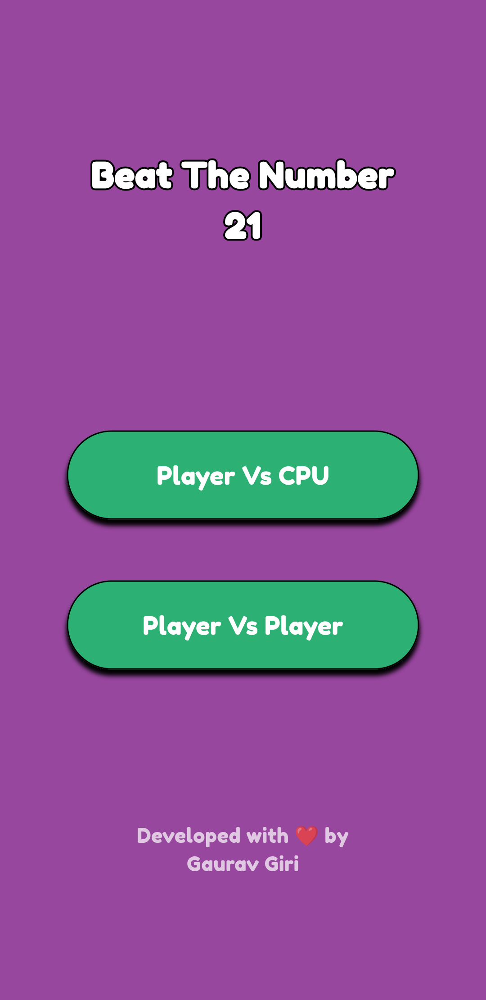

# Beat The Number 21

**Beat The Number 21** is an exciting two-player game where the primary objective is to avoid being the player who reaches the number 21. The game can be played against the CPU or with another player.

## Table of Contents

- [Gameplay](#gameplay)
- [Features](#features)
- [Screenshots](#screenshots)
- [Installation](#installation)
- [How to Play](#how-to-play)
- [Contributing](#contributing)
- [License](#license)

## Gameplay

In Beat The Number 21, players take turns adding numbers from 1 to 3 to a running total. The player who reaches the number 21 loses the game. Strategic thinking and careful planning are crucial to winning.

## Features

- **Single Player Mode:** Play against a CPU with varying difficulty levels.
- **Two Player Mode:** Play with a friend on the same device.
- **Intuitive Interface:** Simple and easy-to-navigate user interface.
- **Real-time Feedback:** Instant feedback on the game's status and moves.

## Screenshots

Here are some screenshots of the game in action:

<div align="center">
  
  
</div>

<div align="center">
  
  
</div>

## Installation

To install and run Beat The Number 21, follow these steps:

1. **Clone the repository:**
   ```bash
   git clone https://github.com/username/beat-the-number-21.git
   ```
2. **Navigate to the project directory:**
   ```bash
   cd beat-the-number-21
   ```
3. **Install the required dependencies:**
   ```bash
   flutter pub get
   ```
4. **Run the game:**
   ```bash
   flutter run
   ```

## How to Play

1. **Start the Game:**
   - Choose to play against the CPU or with another player.
2. **Take Turns:**
   - On your turn, choose a number between 1 and 3.
   - The chosen number is added to the running total.
3. **Avoid 21:**
   - The objective is to avoid being the player who makes the running total reach exactly 21.
4. **Winning the Game:**
   - The player who forces their opponent to reach 21 wins the game.


## Contributing

I welcome contributions from the everyone! If you find any bugs or have suggestions for improvements, feel free to create an issue or submit a pull request.

1. Fork the repository.
2. Create a new branch with a descriptive name.
3. Make your changes and commit them.
4. Push your changes to your fork.
5. Create a pull request with a description of your changes.
